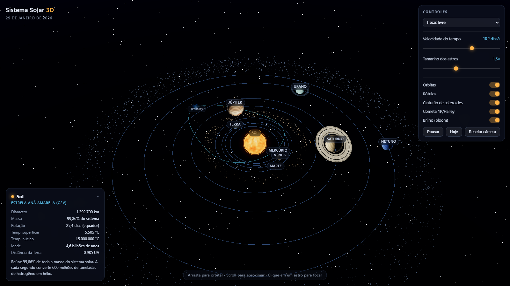
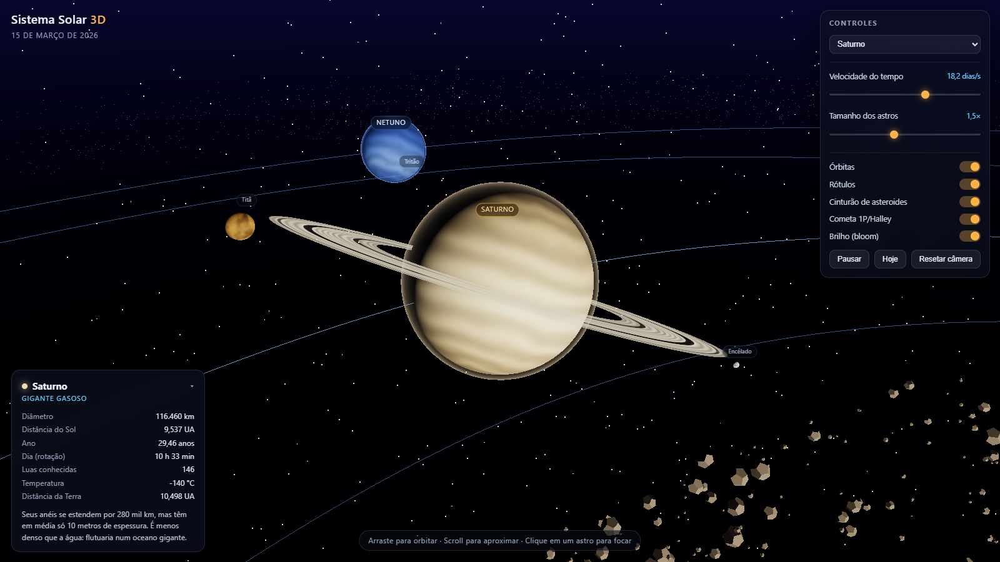

# Sistema Solar 3D

Animação interativa do Sistema Solar em tempo real, feita com **Three.js** (WebGL) em um único arquivo HTML — sem build, sem instalação.

  [](https://mkazimoto.github.io/SistemaSolar3D/)

**▶ Demo ao vivo: <https://mkazimoto.github.io/SistemaSolar3D/>** — publicado pelo GitHub Pages (veja [Publicação](#publicação)).



<sub>Vista geral: órbitas keplerianas, cinturão de asteroides, Cinturão de Kuiper, o cometa 1P/Halley e a data simulada no cabeçalho.</sub>

## Como executar

**Opção 0 — online**
Abra <https://mkazimoto.github.io/SistemaSolar3D/> (publicado automaticamente pelo workflow
`.github/workflows/deploy-pages.yml` a cada push na `main`).

**Opção 1 — direto no navegador**
Dê um duplo clique em `index.html`.

**Opção 2 — servidor local (recomendado se quiser evitar restrições do `file://`)**
Dê um duplo clique em `servir.bat` (requer Node.js) ou execute:

```powershell
node servidor.js 5500
```

Depois abra <http://localhost:5500>.

> O Three.js é carregado de CDN (unpkg), então é necessária conexão com a internet na primeira carga.

## Controles

| Ação | Como |
|---|---|
| Orbitar | arrastar com o mouse |
| Zoom | scroll |
| Focar um astro | clicar nele (ou usar o seletor **Foco**) |
| Pausar / retomar | botão **Pausar** ou `Espaço` |
| Velocidade do tempo | slider (0,05 a 500 dias por segundo) |
| Tamanho dos astros | slider (0,4× a 3×) — não altera as órbitas |
| Voltar à visão geral | botão **Resetar câmera** ou `R` |
| Atalhos | `+` / `-` velocidade · `O` órbitas · `L` rótulos · `R` reset |

Camadas que podem ser ligadas/desligadas: órbitas, rótulos, cinturão de asteroides,
cometa 1P/Halley e o efeito de brilho (*bloom*).

## O que está simulado

- **Órbitas keplerianas reais**: cada planeta usa semi-eixo maior, excentricidade,
  inclinação e período verdadeiros; a equação de Kepler (Newton-Raphson) é resolvida
  a cada quadro, então os planetas aceleram no periélio e desaceleram no afélio.
- **Rotação e inclinação axial** de cada planeta (Vênus e Urano com rotação retrógrada;
  Urano com eixo inclinado 98°).
- **Luas**: Lua, Fobos, Deimos, as quatro luas galileanas, Encélado, Titã, Titânia e Tritão,
  girando no plano equatorial do respectivo planeta.
- **Anéis de Saturno** (com a Divisão de Cassini) e os anéis tênues de Urano.
- **Cinturão de asteroides** (1.600 rochas instanciadas), **Cinturão de Kuiper** e o
  **cometa 1P/Halley** com cauda que aponta sempre para o lado oposto ao Sol e cresce
  perto do periélio.
- **Data simulada** exibida no cabeçalho (parte de 1º de janeiro de 2026).

### Texturas

Todas as texturas são **geradas proceduralmente** em canvas no navegador (ruído de valor +
FBM): continentes, calotas polares, nuvens e luzes noturnas da Terra, bandas turbulentas e a
Grande Mancha Vermelha de Júpiter, granulação solar e poeira lunar com crateras. Nenhum
arquivo de imagem externo é usado.

### Escalas

As distâncias e os tamanhos são **comprimidos** para caber na tela de forma legível
(distância ∝ √AU, raio ∝ R^0,55) — a proporção entre órbitas e períodos, porém, é
astronomicamente correta.

## Capturas

Vista aproximada de Saturno: bandas atmosféricas, anéis com a Divisão de Cassini e as luas Titã e Encélado.



## Estrutura

```
index.html                     aplicação completa (HTML + CSS + JS em módulo)
servidor.js                    servidor estático mínimo, sem dependências (Node)
servir.bat                     sobe o servidor e abre o navegador
docs/                          capturas de tela usadas neste README
.nojekyll                      publica os arquivos como estão (sem processamento Jekyll)
.github/workflows/deploy-pages.yml   publicação automática no GitHub Pages
```

## Publicação

O workflow `.github/workflows/deploy-pages.yml` publica o `index.html` no GitHub Pages sem etapa
de build, a cada push na `main` (ou manualmente em **Actions → Publicar no GitHub Pages → Run
workflow**). Ele se adapta às duas formas de configuração do Pages e nunca falha por causa da
origem escolhida:

| Origem em Settings → Pages | O que o workflow faz |
|---|---|
| **GitHub Actions** (recomendado) | Monta `_site/` com o `index.html` e publica por artefato (`configure-pages` → `upload-pages-artifact` → `deploy-pages`). Só o `index.html` vai para o ar, e o deploy é registrado no ambiente `github-pages`. |
| **Deploy from a branch** | Detecta a origem em branch, emite um aviso (`::warning`) e ignora o deploy por artefato — o site é publicado pela própria origem. A execução termina verde, sem falsos negativos. |

> Enquanto o Pages **não estiver habilitado**, o workflow falha logo no início com a orientação
de habilitá-lo: o `GITHUB_TOKEN` não tem permissão para criar o site do Pages (a action
`configure-pages` exige um PAT com escopo `repo`, ou um GitHub App com `administration:write` +
`pages:write`). Esse passo único é feito pelo dono do repositório.
